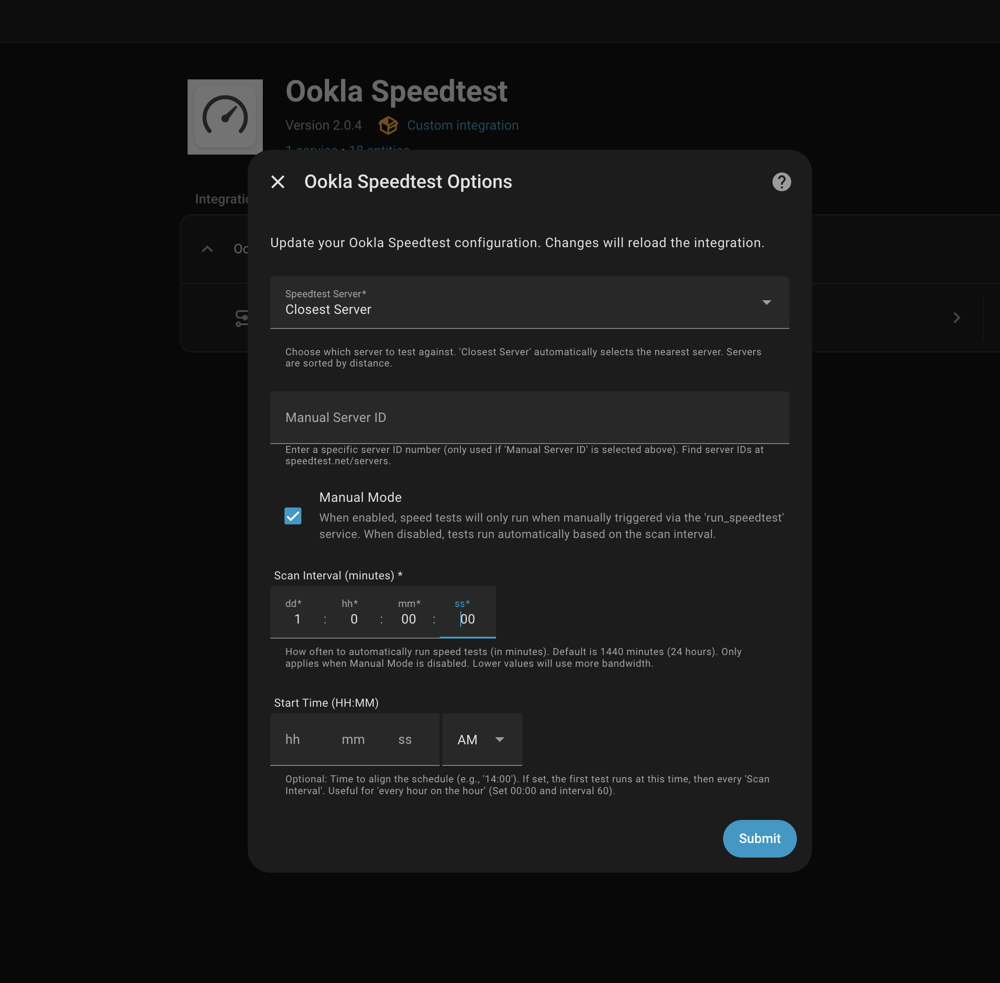

# Ookla Speedtest Integration for Home Assistant

[](https://github.com/hacs/default)
[](https://github.com/soulripper13/hass-speedtest-ookla/releases)
[](https://github.com/soulripper13/hass-speedtest-ookla/issues)


[](#support-the-project)

---

The **Ookla Speedtest** integration allows you to measure and monitor your internet connection performance directly in Home Assistant using the official **Ookla `speedtest-cli`** tool.

It provides sensors for latency, download speed, upload speed, jitter, ISP information, and the test server used — with support for both **automatic** and **manual** testing.


---

## Features

### 📊 Sensors
- **Ping** (ms) – Network latency
- **Download** (Mbit/s)
- **Upload** (Mbit/s)
- **Jitter** (ms) – Network stability
- **Last Test** – Timestamp of the last successful test
- **Server** – Name and location of the test server
- **ISP** – Detected Internet Service Provider

### ⚙️ Flexible Testing
- Automatically select the closest server
- Choose from the 10 nearest servers
- Manually specify a server ID
- **Precise Scheduling**: Run tests at a specific time (e.g., "every hour on the hour")
- Automatic testing at a configurable interval
- Manual-only mode for on-demand testing

### 🧭 User-Friendly Setup
- Full UI-based setup and reconfiguration
- Clear descriptions for every option
- Automatic integration reload on configuration changes
- No YAML required

### ▶️ Service Support
- Run tests on demand via:
```

ookla_speedtest.run_speedtest

```

---

## Installation

This integration is designed to be installed via **HACS**.

### 1️⃣ Add the Repository
- Go to **HACS → Integrations → ⋮ → Custom repositories**
- Add:
```

[https://github.com/soulripper13/hass-speedtest-ookla](https://github.com/soulripper13/hass-speedtest-ookla)

````
- Category: **Integration**

[](https://my.home-assistant.io/redirect/hacs_repository/?owner=soulripper13&repository=hass-speedtest-ookla&category=integration)

---

### 2️⃣ Install
- Search for **Ookla Speedtest** in HACS
- Click **Download**

---

### 3️⃣ Restart Home Assistant
- Go to **Settings → System → Restart**

---

### 4️⃣ Add the Integration
- Go to **Settings → Devices & Services → Add Integration**
- Search for **Ookla Speedtest**

[](https://my.home-assistant.io/redirect/config_flow_start/?domain=ookla_speedtest)

---

## Configuration



All configuration is handled through the Home Assistant UI.

### Options

#### **Speedtest Server**
- Closest server (automatic)
- Select from 10 nearest servers
- Manual server ID

> Tip: Server IDs can be found at  
> https://www.speedtest.net/speedtest-servers-static.php

#### **Manual Server ID**
- Required only when manual mode is selected

#### **Manual Mode**
- **Enabled**: Tests run only when triggered manually
- **Disabled**: Tests run automatically
- Default: **Enabled**

#### **Scan Interval**
- How often to run automatic tests
- Configurable via Duration Selector (e.g., 1 hour, 30 minutes)
- Default: **24 hours**
- *Note: Lower values consume more bandwidth.*

#### **Start Time**
- Optional: Set a specific time for the schedule to start (e.g., `14:00:00`)
- Useful for aligning tests (e.g., set Start Time to `00:00:00` and Interval to `1 hour` to run exactly on the hour)

---

### Reconfiguring
1. Go to **Settings → Devices & Services**
2. Select **Ookla Speedtest**
3. Click **Configure**
4. Update options
5. Integration reloads automatically

---

## Usage

### Sensors Created
- `sensor.ookla_speedtest_ping`
- `sensor.ookla_speedtest_download`
- `sensor.ookla_speedtest_upload`
- `sensor.ookla_speedtest_jitter`
- `sensor.ookla_speedtest_last_test`
- `sensor.ookla_speedtest_isp`
- `sensor.ookla_speedtest_server`

---

### Automation Example

Run a speed test every day at midnight:

```yaml
automation:
- alias: Daily Speedtest
  trigger:
    - platform: time
      at: "00:00:00"
  action:
    - service: ookla_speedtest.run_speedtest
````

---

## Lovelace Card Example

This example uses:

* `custom:apexcharts-card`
* `custom:layout-card`

Install both via HACS.

### Optional Script

```yaml
script:
  speedtest:
    alias: Run Speedtest
    sequence:
      - service: ookla_speedtest.run_speedtest
```

---

### Example Card Configuration

```yaml
type: custom:layout-card
layout_type: custom:vertical-layout
layout:
  width: 320
  card_margin: 0px
cards:
  - type: custom:apexcharts-card
    chart_type: radialBar
    experimental:
      color_threshold: true
    header:
      show: true
      title: Speedtest
      show_states: true
      colorize_states: true
    series:
      - entity: sensor.ookla_speedtest_ping
        name: Ping
        min: 1
        max: 200
        color_threshold:
          - value: 1
            color: green
          - value: 100
            color: orange
          - value: 200
            color: red
        show:
          header_color_threshold: true
      - entity: sensor.ookla_speedtest_download
        name: Download
        min: 0
        max: 1000
        color_threshold:
          - value: 0
            color: red
          - value: 500
            color: orange
          - value: 1000
            color: green
        show:
          header_color_threshold: true
      - entity: sensor.ookla_speedtest_upload
        name: Upload
        min: 0
        max: 110
        color_threshold:
          - value: 0
            color: red
          - value: 55
            color: orange
          - value: 110
            color: green
        show:
          header_color_threshold: true
      - entity: sensor.ookla_speedtest_jitter
        name: Jitter
        color: aqua
        show:
          header_color_threshold: true
          in_chart: false
    apex_config:
      plotOptions:
        radialBar:
          offsetY: 0
          startAngle: -90
          endAngle: 90
          dataLabels:
            name:
              show: false
            value:
              show: false
      legend:
        show: false
      fill:
        type: gradient
    card_mod:
      style: |
        :host {
          margin: 0 !important;
          padding: 0 !important;
        }
  - type: entities
    entities:
      - entity: sensor.ookla_speedtest_isp
        name: ISP
        icon: false
      - entity: sensor.ookla_speedtest_server
        name: Server
        icon: false
    card_mod:
      style: |
        :host {
          margin: 0 !important;
          padding: 0 !important;
          --ha-card-border-width: 0;
        }
  - show_name: true
    show_icon: false
    type: button
    tap_action:
      action: perform-action
      perform_action: ookla_speedtest.run_speedtest
      target: {}
    name: Speedtest
    card_mod:
      style: |
        :host {
          margin: 0 !important;
          padding: 0 !important;
          --ha-card-border-width: 0;
        }

```

Adjust ranges and thresholds to match your internet plan.

---

## Troubleshooting

* **Setup fails**: Check logs at
  **Settings → System → Logs**
* **Configure button error**: Fixed in v2.0.0
* **No server list**: Try closest server or manual ID
* **Card not displaying**: Ensure required custom cards are installed

---

## Debug Logging

```yaml
logger:
  default: info
  logs:
    custom_components.ookla_speedtest: debug
```

---

## Support the Project

This integration is developed and maintained in spare time and is provided free to the Home Assistant community.

If you find it useful and would like to support ongoing development, maintenance, and improvements, any contribution is appreciated — but never required ❤️

### Ways to Support

* **PayPal**
  [https://paypal.me/SKatoaroo](https://paypal.me/SKatoaroo)

* **Bitcoin (BTC)**
  `bc1qvu8a9gdy3dcxa94jge7d3rd7claapsydjsjxn0`

* **Solana (SOL)**
  `4jvCR2YFQLqguoyz9qAMPzVbaEcDsG5nzRHFG8SeaeBK`

You can also help by:

* Reporting bugs
* Submitting pull requests
* Suggesting features
* Helping other users
* Starring the repository ⭐

Thank you for being part of the Home Assistant community.

---

## License

MIT License

