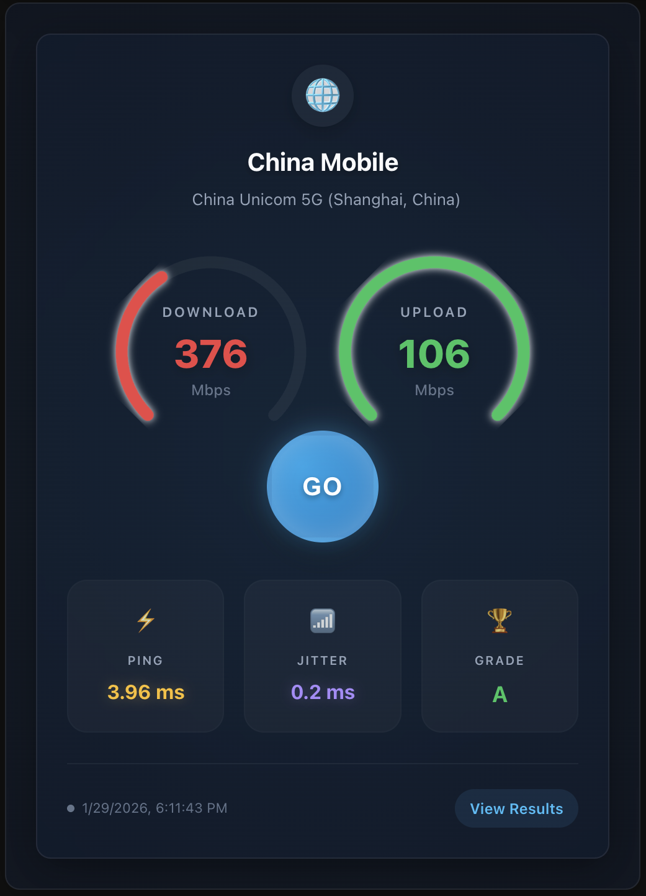
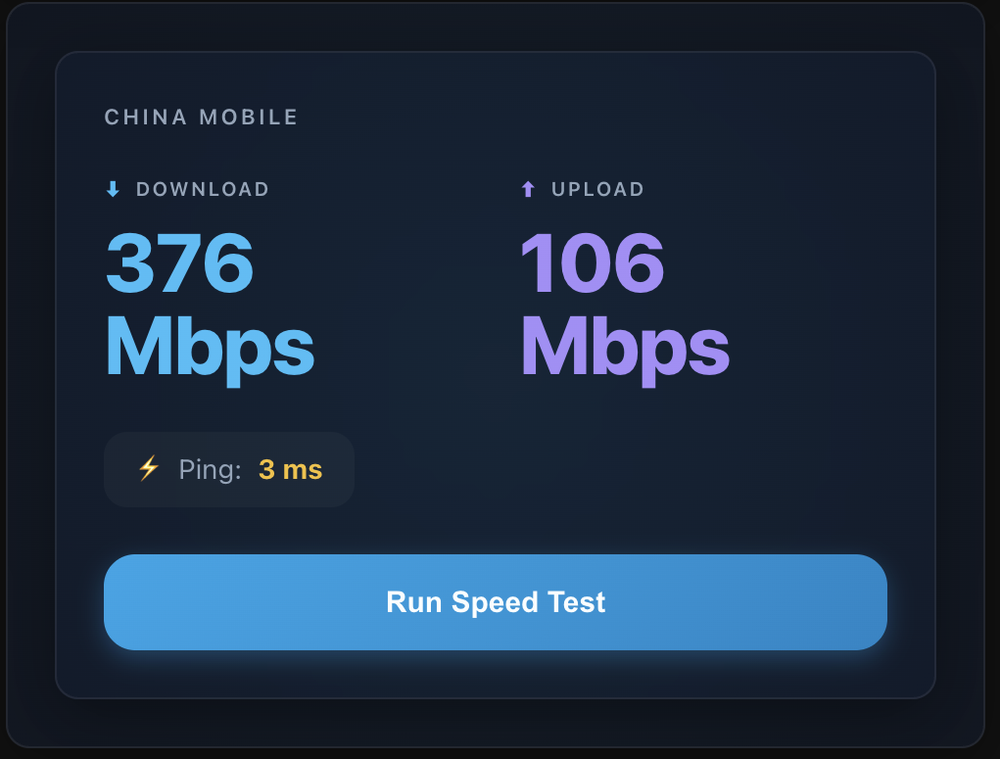
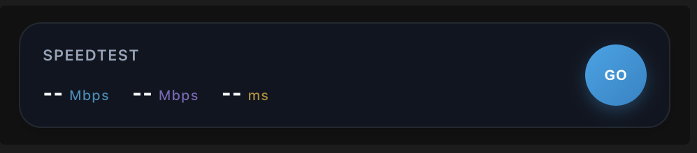
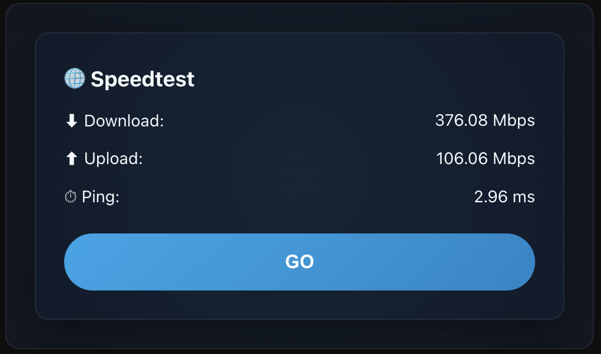

# Ookla Speedtest Integration for Home Assistant

[](https://github.com/hacs/default)
[](https://github.com/soulripper13/hass-speedtest-ookla/releases)
[](https://github.com/soulripper13/hass-speedtest-ookla/issues)


[](#support-the-project)

---

The **Ookla Speedtest** integration allows you to measure and monitor your internet connection performance directly in Home Assistant using the official **Ookla `speedtest-cli`** tool.

It provides sensors for latency, download speed, upload speed, jitter, ISP information, and the test server used — with support for both **automatic** and **manual** testing.


---

## Features

### 📊 Sensors
- **Ping** (ms) – Network latency
- **Download** (Mbit/s)
- **Upload** (Mbit/s)
- **Jitter** (ms) – Network stability
- **Bufferbloat Grade** – Latency stability rating (A-F)
- **Download/Upload Plan Compliance** (%) – Speed vs. ISP rated plan
- **Last Test** – Timestamp of the last successful test
- **Server** – Name and location of the test server
- **ISP** – Detected Internet Service Provider

### ⚙️ Flexible Testing
- Automatically select the closest server
- Choose from the 10 nearest servers
- Manually specify a server ID
- **Precise Scheduling**: Run tests at a specific time (e.g., "every hour on the hour")
- Automatic testing at a configurable interval
- Manual-only mode for on-demand testing

### 🧭 User-Friendly Setup
- Full UI-based setup and reconfiguration
- Clear descriptions for every option
- Automatic integration reload on configuration changes
- No YAML required

### ▶️ Service Support
- Run tests on demand via:
```

ookla_speedtest.run_speedtest

```

---

## Installation

This integration is designed to be installed via **HACS**.

### 1️⃣ Add the Repository
- Go to **HACS → Integrations → ⋮ → Custom repositories**
- Add:
```

[https://github.com/soulripper13/hass-speedtest-ookla](https://github.com/soulripper13/hass-speedtest-ookla)

````
- Category: **Integration**

[](https://my.home-assistant.io/redirect/hacs_repository/?owner=soulripper13&repository=hass-speedtest-ookla&category=integration)

---

### 2️⃣ Install
- Search for **Ookla Speedtest** in HACS
- Click **Download**

---

### 3️⃣ Restart Home Assistant
- Go to **Settings → System → Restart**

---

### 4️⃣ Add the Integration
- Go to **Settings → Devices & Services → Add Integration**
- Search for **Ookla Speedtest**

[](https://my.home-assistant.io/redirect/config_flow_start/?domain=ookla_speedtest)

---

## Configuration


All configuration is handled through the Home Assistant UI.

### Options

#### **Speedtest Server**
- Closest server (automatic)
- Select from 10 nearest servers
- Manual server ID

> Tip: Server IDs can be found at  
> https://www.speedtest.net/speedtest-servers-static.php

#### **Manual Server ID**
- Required only when manual mode is selected

#### **Manual Mode**
- **Enabled**: Tests run only when triggered manually
- **Disabled**: Tests run automatically
- Default: **Enabled**

#### **Scan Interval**
- How often to run automatic tests
- Configurable via Duration Selector (e.g., 1 hour, 30 minutes)
- Default: **24 hours**
- *Note: Lower values consume more bandwidth.*

#### **Start Time**
- Optional: Set a specific time for the schedule to start (e.g., `14:00:00`)
- Useful for aligning tests (e.g., set Start Time to `00:00:00` and Interval to `1 hour` to run exactly on the hour)

---

### Reconfiguring
1. Go to **Settings → Devices & Services**
2. Select **Ookla Speedtest**
3. Click **Configure**
4. Update options
5. Integration reloads automatically

---

## Usage

### 📊 Sensors Created

The integration creates a comprehensive set of sensors. Some are enabled by default, while others can be enabled via the Home Assistant UI.

#### **Enabled by Default**
- `sensor.ookla_speedtest_download` (Mbps)
- `sensor.ookla_speedtest_upload` (Mbps)
- `sensor.ookla_speedtest_ping` (ms)
- `sensor.ookla_speedtest_jitter` (ms)
- `sensor.ookla_speedtest_bufferbloat_grade` (A-F)
- `sensor.ookla_speedtest_isp`
- `sensor.ookla_speedtest_server`
- `sensor.ookla_speedtest_last_test`
- `sensor.ookla_speedtest_result_url`

#### **Extended Metrics (Disabled by Default)**
*Go to Integration Settings → Entities to enable these.*

**Latency Metrics:**
- `sensor.ookla_speedtest_ping_low` (Idle Min)
- `sensor.ookla_speedtest_ping_high` (Idle Max)
- `sensor.ookla_speedtest_ping_during_download` (Avg)
- `sensor.ookla_speedtest_ping_low_during_download` (Min)
- `sensor.ookla_speedtest_ping_high_during_download` (Max)
- `sensor.ookla_speedtest_ping_during_upload` (Avg)
- `sensor.ookla_speedtest_ping_low_during_upload` (Min)
- `sensor.ookla_speedtest_ping_high_during_upload` (Max)

**Stability & Compliance:**
- `sensor.ookla_speedtest_download_percent` (Plan Compliance %)
- `sensor.ookla_speedtest_upload_percent` (Plan Compliance %)
- `sensor.ookla_speedtest_jitter_during_download` (ms)
- `sensor.ookla_speedtest_jitter_during_upload` (ms)

---

### Automation Example

Run a speed test every day at midnight:

```yaml
automation:
- alias: Daily Speedtest
  trigger:
    - platform: time
      at: "00:00:00"
  action:
    - service: ookla_speedtest.run_speedtest
````

---

## 🎨 Lovelace Cards (Auto-Setup!)

This integration includes **beautiful, custom Lovelace cards** that work out of the box - no external dependencies required!

### ✨ New in v1.1.0: Glassmorphism Design
The cards have been completely redesigned with a modern **Glassmorphism** aesthetic, featuring:
- 🌫️ **Frosted Glass Effect**: Semitransparent backgrounds with blur
- 🌈 **Gradient Gauges & Charts**: Beautiful, smooth color transitions
- 📱 **Responsive Layouts**: Looks great on mobile and desktop
- 🖱️ **Visual Editor**: Configure settings directly in the UI!

### 📦 Built-in Cards

| Card | Description | Preview |
|------|-------------|---------|
| `ookla-speedtest-card` | **Full Interface** with radial gauges, "GO" button, and Glassmorphism design. Best for main dashboards. |  |
| `ookla-speedtest-dashboard` | **Dashboard** view with sparkline area charts and detailed metrics. Perfect for network overviews. |  |
| `ookla-speedtest-minimal` | Clean design with large typography. Ideal for minimalist setups. |  |
| `ookla-speedtest-compact` | Small single-line card. Great for side panels or dense views. |  |
| `ookla-speedtest-card-simple` | Basic simplified version for testing and quick setups. |  |

### 🚀 Zero-Config Setup

**Cards are automatically registered when Home Assistant starts!**

1. Install the integration
2. Restart Home Assistant
3. Go to your Dashboard → Edit Dashboard → Add Card
4. Search for **"Ookla"**
5. Select a card and configure it visually!

> **Note:** If cards don't appear immediately, you can force registration by calling the `ookla_speedtest.register_card_resources` service in Developer Tools, or simply refresh your browser cache.

### 🎯 Visual Configuration

The **Ookla Speedtest Card** now supports the visual editor! You can easily adjust:
- **Max Download Speed** (for gauge scaling)
- **Max Upload Speed** (for gauge scaling)

No YAML required! Just add the card and use the form.

```yaml
# Minimal YAML example if you prefer code
type: custom:ookla-speedtest-card
# Configurable via UI:
max_download: 1000 
max_upload: 500
```

📖 **[Full Card Documentation](custom_components/ookla_speedtest/www/README.md)**

---

## Alternative: Custom Card Combinations

If you prefer building cards from existing components, here's an example using `apexcharts-card` and `layout-card`:

**Required:** Install `apexcharts-card`, `layout-card`, and `card-mod` via HACS.

```yaml
type: custom:layout-card
layout_type: custom:vertical-layout
layout:
  width: 320
  card_margin: 0px
cards:
  - type: custom:apexcharts-card
    chart_type: radialBar
    header:
      show: true
      title: Speedtest
    series:
      - entity: sensor.ookla_speedtest_download
        name: Download
        min: 0
        max: 1000
      - entity: sensor.ookla_speedtest_upload
        name: Upload
        min: 0
        max: 500
```

---

## Troubleshooting

* **Setup fails**: Check logs at
  **Settings → System → Logs**
* **Configure button error**: Fixed in v2.0.0
* **No server list**: Try closest server or manual ID
* **Card not displaying**: Ensure required custom cards are installed

---

## Debug Logging

```yaml
logger:
  default: info
  logs:
    custom_components.ookla_speedtest: debug
```

---

## Support the Project

This integration is developed and maintained in spare time and is provided free to the Home Assistant community.

If you find it useful and would like to support ongoing development, maintenance, and improvements, any contribution is appreciated — but never required ❤️

### Ways to Support

* **PayPal**
  [https://paypal.me/SKatoaroo](https://paypal.me/SKatoaroo)

* **Bitcoin (BTC)**
  `bc1qvu8a9gdy3dcxa94jge7d3rd7claapsydjsjxn0`

* **Solana (SOL)**
  `4jvCR2YFQLqguoyz9qAMPzVbaEcDsG5nzRHFG8SeaeBK`

You can also help by:

* Reporting bugs
* Submitting pull requests
* Suggesting features
* Helping other users
* Starring the repository ⭐

Thank you for being part of the Home Assistant community.

---

## License

MIT License

